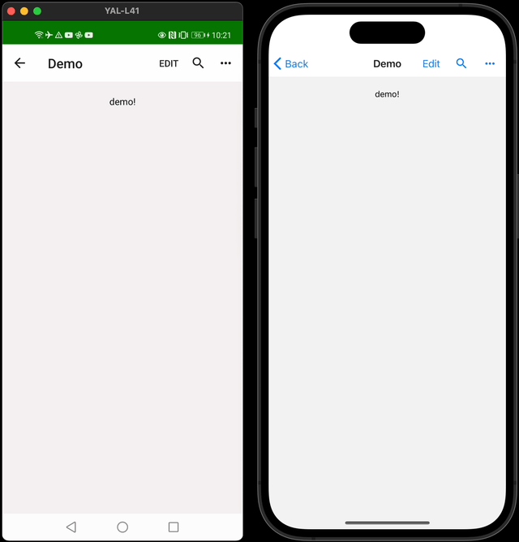
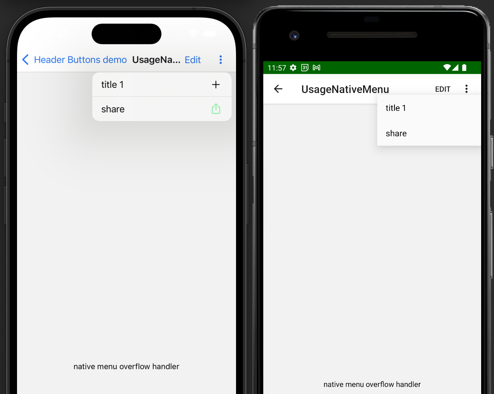

# react-navigation-header-buttons

This package will help you render buttons in the navigation bar and handle the styling, so you don't have to. It mimics the appearance of native navbar buttons and offers a simple but also flexible interface for you to interact with.

✅ DRY library api

✅ Works great with icons from `@expo/vector-icons` / `react-native-vector-icons` or any other icon library

✅ Supports both [JS](https://reactnavigation.org/docs/stack-navigator) and [native](https://reactnavigation.org/docs/native-stack-navigator/) stack

✅ Beautiful overflow menus for items that don't fit into the navbar

✅ [Recipes](#recipes) and examples included

✅ Written in TS

#### Demo App

Contains many examples in the [example folder](https://github.com/vonovak/react-navigation-header-buttons/tree/master/example/src/screens). I highly recommend you check it out to get a better idea of the api.

#### Quick Example

<span>

</span>

<details><summary>more screenshots</summary>


</details>

The corresponding code:

```tsx
import * as React from 'react';
import MaterialIcons from '@expo/vector-icons/MaterialIcons';
import {
  HeaderButtons,
  Item,
  HiddenItem,
  OverflowMenu,
  Divider,
  ItemProps,
  HiddenItemProps,
  HeaderButtonProps,
  HeaderButton,
} from 'react-navigation-header-buttons';
import { Text } from 'react-native';

const MaterialHeaderButton = (props: HeaderButtonProps) => (
  // the `props` here come from <Item ... />
  // you may access them and pass something else to `HeaderButton` if you like
  <HeaderButton IconComponent={MaterialIcons} iconSize={23} {...props} />
);

const EditItem = ({ onPress }: Pick<ItemProps, 'onPress'>) => {
  return <Item title="edit" onPress={onPress} />;
};

const ReusableHiddenItem = ({ onPress }: Pick<HiddenItemProps, 'onPress'>) => (
  <HiddenItem title="hidden2" onPress={onPress} disabled />
);

export function UsageWithIcons({ navigation }) {
  React.useLayoutEffect(() => {
    navigation.setOptions({
      title: 'Demo',
      // in your app, extract the arrow function into a separate component
      // to avoid creating a new one every time
      headerRight: () => (
        <HeaderButtons HeaderButtonComponent={MaterialHeaderButton}>
          <EditItem onPress={() => alert('Edit')} />
          <Item
            title="search"
            iconName="search"
            onPress={() => alert('search')}
          />
          <OverflowMenu
            OverflowIcon={({ color }) => (
              <MaterialIcons name="more-horiz" size={23} color={color} />
            )}
          >
            <HiddenItem title="hidden1" onPress={() => alert('hidden1')} />
            <Divider />
            <ReusableHiddenItem onPress={() => alert('hidden2')} />
          </OverflowMenu>
        </HeaderButtons>
      ),
    });
  }, [navigation]);

  return <Text>demo!</Text>;
}
```

## Setup

Version >= 11 requires React Native 0.71 / Expo 48 or newer. Use version 10 if you're on older version of RN / Expo.

1. `yarn add react-navigation-header-buttons`

2. Wrap your root component in `HeaderButtonsProvider` and pass the `stackType` prop (`'native' | 'js'`), as seen in [example's App.tsx](https://github.com/vonovak/react-navigation-header-buttons/blob/master/example/src/App.tsx).

**IMPORTANT** `HeaderButtonsProvider` must be placed as a descendant of `NavigationContainer`, otherwise this library will not receive the correct theme from React Navigation.

## Usage

### `HeaderButtons`

Is a wrapper over all the visible header buttons (those can be text-buttons, icon-button, or any custom react elements).

You should provide the `HeaderButtonComponent` prop that encapsulates how all buttons rendered in children will look. Typically, you'll want to provide a component that wraps [`HeaderButton`](#headerbutton) as seen in the example. However, you're free to use your own component (see `HeaderButton.tsx` for reference).

In particular, it allows setting `IconComponent`, `size` and `color` once so that you don't need to repeat it for each icon-button - but you can override those for each `Item` if you like.

`HeaderButtons` accepts:

| prop and type                                              | description                                                                                                                                                     | note                                                                                                                                              |
| ---------------------------------------------------------- | --------------------------------------------------------------------------------------------------------------------------------------------------------------- | ------------------------------------------------------------------------------------------------------------------------------------------------- |
| HeaderButtonComponent?: `ComponentType<HeaderButtonProps>` | component that renders the buttons, `HeaderButton` by default                                                                                                   | Typically, you'll want to provide a component that wraps `HeaderButton` provided by this package, as seen in the [quick example](#quick-example). |
| children: ReactNode                                        | whatever you want to render inside                                                                                                                              | Typically, `Item` or your component that renders `Item`, but it can be any React element.                                                         |
| left?: boolean                                             | whether the `HeaderButtons` are on the left from header title                                                                                                   | false by default, it only influences styling in a subtle way                                                                                      |
| preset?: 'tabHeader' \| 'stackHeader'                      | headers are typically rendered in Stack Navigator, however, you can also render them in a Tab Navigator header. Pass 'tabHeader' if button margins are missing. | 'stackHeader' by default                                                                                                                          |

### `Item`

Renders text, or icon inside a [PlatformPressable](https://reactnavigation.org/docs/elements/#platformpressable). Take a look at the example to see how to use it.

`Item` accepts:

| prop and type           | description                                                                           |
| ----------------------- | ------------------------------------------------------------------------------------- |
| title: string           | title for the button, required                                                        |
| onPress: ?() => any     | function to call on press                                                             |
| iconName?: string       | icon name, used together with the `IconComponent` prop                                |
| style?: ViewStyle       | style to apply to the touchable element that wraps the button                         |
| buttonStyle?: ViewStyle | style to apply to the text / icon                                                     |
| other props             | whatever else you want to pass to the underlying `PlatformPressable` (eg. `disabled`) |

`Item` also accepts other props that you'll typically not need to pass because `HeaderButtonComponent` already knows them (eg. `iconSize`) or because they are pulled from the React Navigation's theme object (`color`).

| additional props and type                                | description                                                                             | note |
| -------------------------------------------------------- | --------------------------------------------------------------------------------------- | ---- |
| IconComponent?: ComponentType                            | component to use for the icons, for example from `react-native-vector-icons`            |      |
| iconSize?: number                                        | iconSize                                                                                |      |
| color?: string                                           | color of icons and buttons                                                              |      |
| renderButton?: (params: VisibleButtonProps) => ReactNode | renders the body of the button (text or icon), defaults to `defaultRenderVisibleButton` |      |

### `OverflowMenu`

Defines the behavior for overflow button (if there is one). Please note you can render `OverflowMenu` only by itself too, you do not need to wrap it in `HeaderButtons`.
The most important prop is `onPress` which defines what kind of overflow menu we should show.

The package exports common handlers you can use, but you can provide your own too (via the `onPress` prop):

| exported handler                       | description                                                                                                                                                                                                                                                                                           |
| -------------------------------------- | ----------------------------------------------------------------------------------------------------------------------------------------------------------------------------------------------------------------------------------------------------------------------------------------------------- |
| `overflowMenuPressHandlerActionSheet`  | This is iOS-only: it displays overflow items in an `ActionSheetIOS`                                                                                                                                                                                                                                   |
| `overflowMenuPressHandlerPopupMenu`    | This is Android-only: it displays overflow items using `UIManager.showPopupMenu`                                                                                                                                                                                                                      |
| `overflowMenuPressHandlerDropdownMenu` | Can be used in iOS, Android and Web. Displays overflow items in a material popup adapted from [react-native-paper](https://callstack.github.io/react-native-paper/menu.html), credit for an amazing job goes to them. This `Menu` is bundled in this library (no dependency on `react-native-paper`). |
| `defaultOnOverflowMenuPress`           | The default. Uses `overflowMenuPressHandlerActionSheet` on iOS, and `overflowMenuPressHandlerDropdownMenu` otherwise.                                                                                                                                                                                 |

You can also use the [react-native-menu](https://github.com/react-native-menu/menu) to show the overflow menu, as seen in the example app.

`OverflowMenu` accepts:

| prop and type                                | description                                                 | note                                                                                                                    |
| -------------------------------------------- | ----------------------------------------------------------- |-------------------------------------------------------------------------------------------------------------------------|
| OverflowIcon: ReactElement \| ComponentType  | React element or component for the overflow icon            | if you provide a component, it will receive `color` prop as seen in example above                                       |
| style?: ViewStyle                            | optional styles for overflow button                         | there are some default styles set, as seen in `OverflowButton.tsx`                                                      |
| onPress?: (OnOverflowMenuPressParams) => any | function that is called when overflow menu is pressed.      | This will override the default handler. Note the default handler offers (limited) customization. See more in "Recipes". |
| testID?: string                              | testID to locate the overflow button in e2e tests           | the default is available under `import { OVERFLOW_BUTTON_TEST_ID } from 'react-navigation-header-buttons/e2e'`          |
| accessibilityLabel?: string                  |                                                             | 'More options' by default                                                                                               |
| left?: boolean                               | whether the `OverflowMenu` is on the left from header title | false by default, it just influences styling. No need to pass this if you already passed it to `HeaderButtons`.         |
| children: ReactNode                          | the overflow items                                          | typically `HiddenItem`s, please read the note below                                                                     |
| preset?: 'tabHeader' \| 'stackHeader'        |                                                             | see [props of headerbuttons](#headerbuttons)                                                                            |
| other props                                  | props passed to the nested `PlatformPressable`              | pass eg. `pressColor` to control ripple color on Android                                                                |

##### Important note

Children passed to `OverflowMenu` should be

- either `HiddenItem`s
- or plain function components (no class components) without hooks that return `HiddenItem`, as seen in the example above.

Anything else will be ignored and will not appear in the overflow menus shown by `overflowMenuPressHandlerActionSheet` and `overflowMenuPressHandlerPopupMenu`.
Only `overflowMenuPressHandlerDropdownMenu` supports rendering custom elements, such as `<Divider />` (which is exported) or your custom ones.

This limitation may look weird, but it should not really bother you in any way: if you need to have state in your items, lift the state up.
The limitation exists because we need to be able to transform declarative React elements into imperative calls (`ActionSheetIOS.showActionSheetWithOptions` / `UIManager.showPopupMenu`).
If this is a problem for you for some reason, please raise an issue, and we'll see what can be done about it.

If `OverflowMenu` contains no valid child elements, nothing will be rendered at all. (No `OverflowIcon`, no wrapper.)

<details><summary>examples</summary>
<p>

Please see `UsageWithOverflowComplex.tsx` for valid examples!

These will NOT work with `overflowMenuPressHandlerActionSheet` and `overflowMenuPressHandlerPopupMenu`:

1. WRONG! no hooks are allowed!

```js
function MyComponent({ title }) {
  const [titleFromState, setTitle] = React.useState('from state hook');
  return (
    <HiddenItem title={titleFromState + title} onPress={() => alert('fail')} />
  );
}

<OverflowMenu
  OverflowIcon={<Ionicons name="ios-more" size={23} color="blue" />}
>
  <MyComponent />
</OverflowMenu>;
```

2. WRONG! you can nest `HiddenItem` only once, not twice

```js
const HiddenItemWrapped = () => <HiddenItem title="hidden2" onPress={() => alert('hidden2')} />;
const HiddenItemWrappedTwice = ()=> <HiddenItemWrapped />

<OverflowMenu OverflowIcon={<Ionicons name="ios-more" size={23} color="blue" />}>
  <HiddenItemWrappedTwice />
</OverflowMenu>;
```

</p>
</details>

#### `HiddenItem`

`HiddenItem` accepts:

| prop and type          | description                                                        | note                                                                   |
| ---------------------- | ------------------------------------------------------------------ | ---------------------------------------------------------------------- |
| title: string          | title for the button, required                                     |                                                                        |
| style?: ViewStyle      | style to apply to the touchable element that wraps the text        |                                                                        |
| titleStyle?: TextStyle | style to apply to the text                                         |                                                                        |
| onPress: ?() => any    | function to call on press                                          |                                                                        |
| testID?: string        | testID to locate view in e2e tests                                 |                                                                        |
| disabled?: boolean     | disabled 'item' is greyed out and `onPress` is not called on touch |                                                                        |
| destructive?: boolean  | flag specifying whether this item is destructive                   | only applies to items shown with `overflowMenuPressHandlerActionSheet` |

### `HeaderButtonsProvider`

You need to wrap your root component with `<HeaderButtonsProvider />`. `stackType` is a required prop, which indicates whether you're using a native or JS stack.

Optional `spaceAboveMenu` prop can be used to set the distance between the top of the screen and the top of the overflow menu.

### `HeaderButton`

`HeaderButton` is where all the `onPress`, `title` and Icon-related props (color, size) meet to render actual button.

You can fully customize what it renders inside of the `PlatformPressable` using the `renderButton?: (params: VisibleButtonProps) => ReactNode` prop.

## Recipes

#### Customizing the overflow menu

The default handler for overflow menu on iOS is `overflowMenuPressHandlerActionSheet`.

One of the usual things you may want to do is override the cancel button label on iOS - see [example](example/src/screens/UsageWithOverflow.tsx).

You can also use the [react-native-menu](https://github.com/react-native-menu/menu) to show the overflow menu, as seen in the example app.

#### Using custom text transforms

Use the `buttonStyle` prop to set [`textTransform`](https://reactnative.dev/docs/text-style-props#texttransform) styles for button titles.

#### How to integrate in your project

This sections covers how you should use the library in your project. Please note that there are numerous [example screens](https://github.com/vonovak/react-navigation-header-buttons/tree/master/example/src/screens).

1 . Define one file where the styling of header buttons is taken care of.

```js
// MyHeaderButtons.js

import * as React from 'react';
import MaterialIcons from 'react-native-vector-icons/MaterialIcons';
import { HeaderButtons, HeaderButton } from 'react-navigation-header-buttons';

// define IconComponent, color, sizes and OverflowIcon in one place
const MaterialHeaderButton = (props) => (
  <HeaderButton
    IconComponent={MaterialIcons}
    iconSize={23}
    color="blue"
    {...props}
  />
);

export const MaterialHeaderButtons = (props) => {
  return (
    <HeaderButtons HeaderButtonComponent={MaterialHeaderButton} {...props} />
  );
};
```

2 . Import header buttons from the file defined previously.

```js
// SomeScreen.js
import { MaterialHeaderButtons } from './MyHeaderButtons';
import { Item } from 'react-navigation-header-buttons';

React.useLayoutEffect(() => {
  navigation.setOptions({
    title: 'Demo',
    // use MaterialHeaderButtons with consistent styling across your app
    headerRight: () => (
      <MaterialHeaderButtons>
        <Item
          title="add"
          iconName="search"
          onPress={() => console.warn('add')}
        />
        <Item title="edit" onPress={() => console.warn('edit')} />
      </MaterialHeaderButtons>
    ),
  });
}, [navigation]);
```

### Theming

Colors for Android ripple effect, text and icons come from [React Navigation's theme](https://reactnavigation.org/docs/themes/), so you do not need to work with colors, with the exception of `OverflowIcon`. You can always override colors of text&icons (using `color` prop) or of the ripple effect on Android (using `pressColor` prop) as [documented](#item).

### Known issues

- it appears that when screen title is long, it might interfere with buttons (does not happen when using native stack). This is more probably a react-navigation error, but needs investigation.
- missing styling support for material dropdown menu
- item margins need to be reviewed and polished; don't hesitate to contribute - [this](https://github.com/infinitered/reactotron/blob/master/docs/plugin-overlay.md) should help
- RTL is not tested
- web support is experimental
- ripple may look different on the header buttons vs on the back button if your version of react navigation does not have [this PR](https://github.com/react-navigation/react-navigation/pull/11386).
